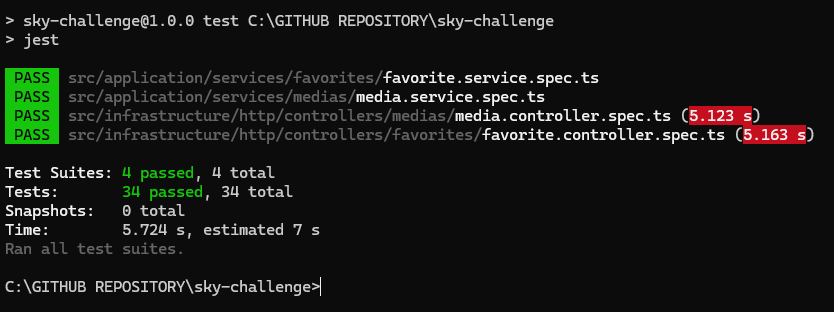

# Cinemais - API de Catálogo e Favoritos

🎬 **API RESTful para plataforma de streaming** desenvolvida seguindo os princípios de **Clean Architecture**, **SOLID** e **Domain-Driven Design (DDD)**.

## 📋 Sobre o Projeto

Sistema backend para gerenciamento de catálogo de mídias (filmes e séries) e listas de favoritos de usuários, implementado com as melhores práticas de desenvolvimento e arquitetura de software.

---

## 🗂 Banco de Dados PostgreSQL

Este projeto utiliza PostgreSQL como banco de dados relacional para armazenar as informações de catálogo e favoritos.

Para uma explicação detalhada da estrutura do banco, incluindo fluxogramas e modelos entidade-relacionamento, acesse o exemplo completo e documentação no link abaixo:

👉 [Exemplo e explicação do banco PostgreSQL com fluxograma](https://github.com/Vidigal-code/sky-challenge/tree/main/example/dbexamplefluxograma)

Nesse diretório você encontrará:

- Diagramas MER e fluxogramas usando Mermaid para visualizar a estrutura do banco.
- Documentação explicando o modelo de dados e relacionamentos.

---

## ⚙️ Configurações do Projeto

Para que o projeto funcione corretamente, é necessário criar um arquivo `.env` na raiz do projeto com as seguintes configurações:

```env
POSTGRES_USER=vidigal
POSTGRES_PASSWORD=test1234
POSTGRES_DB=media_db
POSTGRES_HOST=localhost
POSTGRES_PORT=5432

BACKEND_PORT=3000
BACKEND_LOGS=false
BACKEND_HOST=localhost

```

## 🔧 Ativando os logs

Para que os logs funcionem corretamente, é necessário ativar a variável de ambiente no `.env`:

```env
BACKEND_LOGS=true
```

---

## 🚀 Tecnologias e Arquitetura

- **Node.js** + **TypeScript** - Base sólida e type-safe
- **NestJS** - Framework robusto com injeção de dependências nativa
- **Docker** + **Docker Compose** - Containerização completa
- **Jest** - Testes unitários e de integração
- **PostgreSQL** - Banco de dados relacional

## 🏗️ Princípios Aplicados

### **Clean Architecture**
- Separação clara entre camadas (Domain, Application, Infrastructure)
- Inversão de dependências
- Independência de frameworks e ferramentas externas

### **SOLID Principles**
- **S**ingle Responsibility - Cada classe possui uma única responsabilidade
- **O**pen/Closed - Aberto para extensão, fechado para modificação
- **L**iskov Substitution - Substituição de objetos por suas subclasses
- **I**nterface Segregation - Interfaces específicas e coesas
- **D**ependency Inversion - Dependência de abstrações, não implementações

### **Domain-Driven Design (DDD)**
- Modelagem rica do domínio
- Agregados e entidades bem definidas
- Repositórios para abstração de persistência
- Services de domínio e aplicação

# Arquitetura do Projeto: Um Ponto de Partida Sólido para DDD

Este documento resume o estado atual da arquitetura do projeto e serve como um guia para sua evolução.

A arquitetura atual **é uma excelente base inicial** para um projeto que pretende escalar, pois já adota práticas fundamentais do **Domain-Driven Design (DDD)** e da **Clean Architecture**. Ela não é apenas um protótipo, mas uma fundação robusta pronta para crescer.

## ✅ O Que Já Temos (Boas Práticas DDD Implementadas)

A estrutura atual segue princípios essenciais que garantem organização, testabilidade e baixo acoplamento:

1.  **Separação Clara de Camadas (`Domain`, `Application`, `Infrastructure`)**:
    -   A lógica de negócio (`Domain`) está isolada de detalhes técnicos, como o banco de dados ou a API REST (`Infrastructure`).
    -   Os casos de uso (`Application`) orquestram o fluxo, conectando o mundo externo com o domínio.

2.  **Inversão de Dependência (`Dependency Inversion Principle`)**:
    -   As camadas de negócio dependem de **abstrações** (interfaces como `MediaRepository`), não de implementações concretas (`TypeOrmMediaRepository`).
    -   Isso torna a aplicação flexível para trocar tecnologias (ex: trocar o banco de dados) sem impactar as regras de negócio.

3.  **Exceções de Domínio (`Domain-Specific Exceptions`)**:
    -   Erros de negócio são tratados de forma explícita (ex: `MediaNotFoundError`, `LangNotFoundError`), tornando a comunicação entre as camadas clara e significativa.

4.  **Estrutura Modular e Coesa**:
    -   O uso de módulos do NestJS (`MediaModule`, `LangModule`) agrupa as responsabilidades de cada domínio, facilitando a manutenção e a adição de novas funcionalidades.

## 🚀 Roteiro para uma Arquitetura DDD Completa

Para evoluir a arquitetura e lidar com o aumento da complexidade do negócio, os seguintes padrões táticos de DDD são os próximos passos naturais. Eles complementam e fortalecem a base já existente.

### 1. Centralização do Tratamento de Erros (Exception Filters)
-   **O que falta:** A lógica de `try...catch` está replicada em cada método do `MediaController`.
-   **Ação:** Criar um **`ExceptionFilter`** global no NestJS para capturar as exceções de domínio e mapeá-las para respostas HTTP.
-   **Benefício Imediato:** Remove código repetitivo dos controllers, deixando-os mais limpos e focados em receber requisições e retornar respostas.

### 2. Enriquecimento do Domínio (Value Objects)
-   **O que falta:** Conceitos de negócio são representados por tipos primitivos (ex: `releaseYear` como `number`).
-   **Ação:** Criar classes imutáveis (Value Objects) para esses conceitos, como `class ReleaseYear` ou `class Title`, que validam a si mesmas na criação.
-   **Benefício:** Garante que um dado de domínio nunca exista em um estado inválido e torna o código mais expressivo e seguro.

### 3. Delimitação de Transações (Aggregates)
-   **O que falta:** Uma definição explícita dos limites que garantem a consistência de um grupo de entidades relacionadas.
-   **Ação:** Definir **Agregados** e suas **Raízes de Agregado**. Por exemplo, se uma `Serie` tem `Temporadas`, a entidade `Serie` seria a raiz. O acesso e a modificação de `Temporadas` deveriam ocorrer **apenas** através de métodos na entidade `Serie`.
-   **Benefício:** Protege as regras de negócio e garante a integridade dos dados em operações complexas.

### 4. Desacoplamento de Efeitos Colaterais (Domain Events)
-   **O que falta:** Ações secundárias (como enviar uma notificação após a criação de uma mídia) estão acopladas ao fluxo principal do caso de uso.
-   **Ação:** Disparar **Eventos de Domínio** (ex: `MediaCreatedEvent`) quando algo importante acontece. Outras partes do sistema podem "ouvir" esses eventos e reagir a eles de forma desacoplada.
-   **Benefício:** Aumenta a escalabilidade e a manutenibilidade, permitindo que novas funcionalidades sejam adicionadas sem alterar o código existente.

## Conclusão

A arquitetura atual é o ponto de partida ideal. Ela permite adicionar novos endpoints e domínios seguindo o mesmo padrão de alta qualidade. Os pontos do roteiro acima não são correções, mas sim **estratégias de evolução** a serem aplicadas conforme a necessidade e a complexidade do projeto aumentarem.

## 🎯 Funcionalidades

### **Catálogo de Mídias** (`/media`)
- ✅ **POST** - Adicionar filme/série ao catálogo
- ✅ **GET** - Listar todo o catálogo
- ✅ **GET** `/:id` - Buscar mídia específica

👉 [Exemplos e Explicações dos Endpoints de Mídia ](https://github.com/Vidigal-code/sky-challenge/tree/main/example/mediaexample)


### **Favoritos do Usuário** (`/users/:userId/favorites`)
- ✅ **POST** - Adicionar mídia aos favoritos
- ✅ **GET** - Listar favoritos do usuário
- ✅ **DELETE** `/:mediaId` - Remover dos favoritos

👉 [Exemplos e Explicações dos Endpoints de Favoritos ](https://github.com/Vidigal-code/sky-challenge/tree/main/example/favoriteexample)


## 🔧 Recursos Técnicos

- 📦 **Containerização** completa com Docker
- 🧪 **Testes unitários** e de integração com Jest
- 🛡️ **Validação** robusta de dados (DTOs + class-validator)
- 🚨 **Tratamento de erros** centralizado
- 📚 **Documentação** automática com Swagger/OpenAPI
- 🔍 **Logs** estruturados
- ⚡ **Performance** otimizada

## 🏃‍♂️ Quick Start

```bash
# Subir toda a aplicação
docker-compose up -d

# Rodar testes
npm run test

# Acessar documentação
http://localhost:3000
```

## 📐 Estrutura do Projeto

```
src/
├── domain/           # Entidades, VOs, Agregados
├── application/      # Use Cases, DTOs, Ports
├── infrastructure/   # Repositories, Controllers
└── shared/          # Utilitários e tipos compartilhados
```

---

*Desenvolvido seguindo as melhores práticas de **Clean Code**, **SOLID** e **DDD** para garantir código maintível, testável e escalável.*

# 🧪 Testes Automatizados com Jest - Módulos de Mídias e Favoritos

Este documento descreve os testes automatizados para os módulos de **Mídias** e **Favoritos**, utilizando o framework [Jest](https://jestjs.io/) com a abordagem **TDD** (Test Driven Development). Os testes garantem confiabilidade e robustez para as funcionalidades de gerenciamento de mídias e favoritos na aplicação.

---

## ✅ O que os testes cobrem?

### 🔧 MediaService (`media.service.spec.ts`)

Testa a lógica de negócio da camada de serviço para mídias.

- **Criação de mídias**: Sucesso com dados válidos; lança `MediaInvalidDataError` para título inválido; (comentado) `MediaAlreadyExistsError` para mídia existente.
- **Busca de mídias**: Retorna todas as mídias ou por ID; lança `MediaNotFoundError` se não encontrada; `MediaUnexpectedError` para erros inesperados.
- **Busca por idioma (`langCode`)**: Retorna mídias por idioma; lança `LangNotFoundError` se idioma não existe.

### 🕹️ MediaController (`media.controller.spec.ts`)

Testa a camada de controle para requisições HTTP de mídias.

- **Criação**: Retorna `201 Created` para sucesso; `409 Conflict` para mídia existente; `404 Not Found` para erros.
- **Listagem**: Retorna `200 OK` com todas as mídias.
- **Consulta por ID/idioma**: Retorna `200 OK` ou `404 Not Found` com erros específicos.

---

### 🔧 FavoriteService (`favorite.service.spec.ts`)

Testa a lógica de negócio da camada de serviço para favoritos.

- **Criação de favoritos**: Sucesso com usuário e mídia válidos; lança `UserNotFoundError`, `MediaNotFoundError` ou `FavoriteAlreadyExistsError`.
- **Busca de favoritos**: Retorna mídias favoritas de um usuário; lança `UserNotFoundError` se usuário não existe.
- **Remoção de favoritos**: Sucesso ao remover; lança `UserNotFoundError` ou `FavoriteNotFoundError`.

### 🕹️ FavoriteController (`favorite.controller.spec.ts`)

Testa a camada de controle para requisições HTTP de favoritos.

- **Criação**: Retorna `204 No Content` para sucesso; `404 Not Found` ou `409 Conflict` para erros.
- **Listagem**: Retorna `200 OK` com favoritos; `404 Not Found` para usuário inexistente.
- **Remoção**: Retorna `204 No Content` ou `404 Not Found` para erros.

---

## 🧪 Ferramentas e Tecnologias

- **Jest**: Framework de testes.
- **@nestjs/testing**: Suporte para testes em NestJS.
- **Mocks**: Isolamento de dependências com `jest.fn()`.
- **DTOs e Entidades**: Simulação de dados reais.
- **ResponseMapper**: Padronização de respostas de sucesso e erro.

---

## 📝 Observações

- Testes **unitários**, sem chamadas reais a banco de dados ou APIs.
- Foco em casos críticos com tratamento de exceções personalizadas.
- Respostas padronizadas via `ResponseMapper`/`ResponseMapperFavoriteService`.

---

## 🚀 Execução dos Testes

Rodar testes localmente:

```bash
npm test
# ou
pnpm test
```

Com cobertura:

```bash
npm test -- --coverage
```

---

## 🔒 Cobertura de Segurança

- Validação de dados (usuário, mídia, título) antes da persistência.
- Exceções específicas evitam exposição de detalhes internos.
- Simulação de falhas para respostas consistentes.

---

## 📊 Exemplos de Cobertura



---
