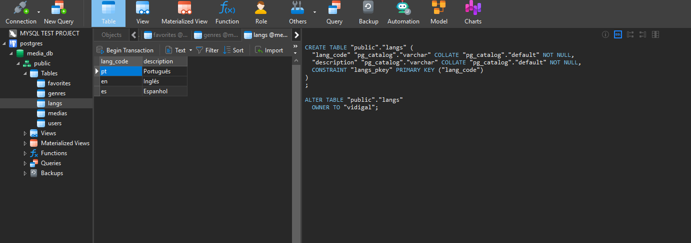
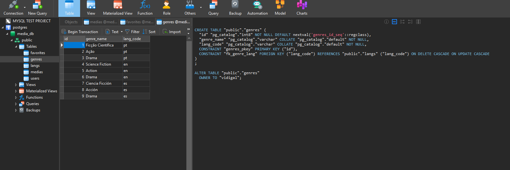
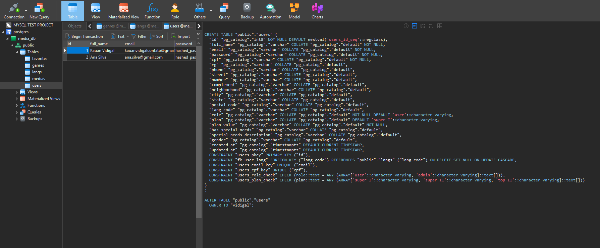
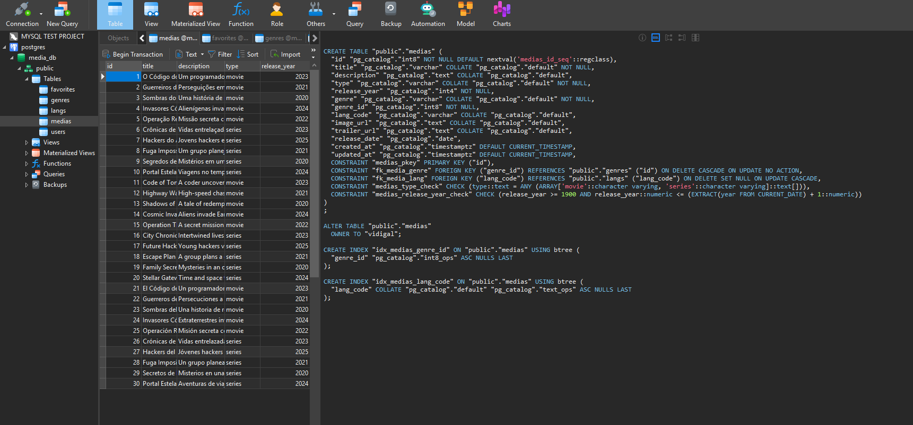
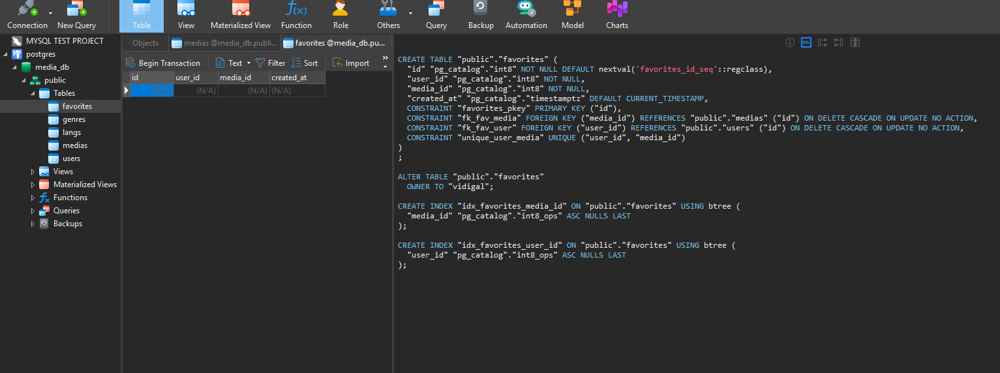
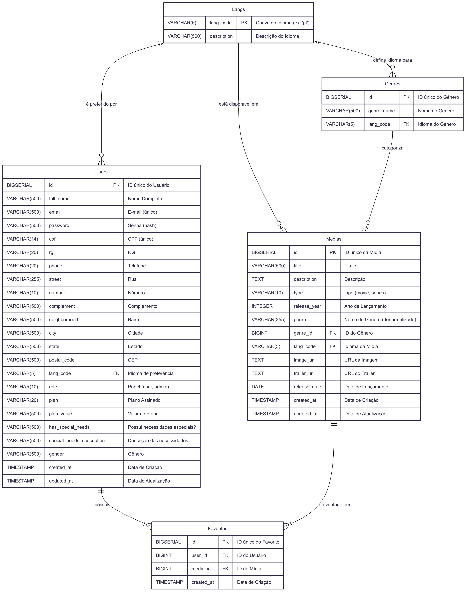

# Projeto de Banco de Dados para Plataforma de Mídia

Este repositório contém o esquema de um banco de dados relacional projetado para uma aplicação de streaming de mídia, como filmes e séries. A estrutura foi desenvolvida em SQL, utilizando o **PostgreSQL** como sistema de gerenciamento de banco de dados, com foco em performance e integridade dos dados. O projeto utiliza **Docker** e **Docker Compose** para facilitar a configuração e execução do ambiente.

## Estrutura do Projeto

- **Diagrama de Entidade-Relacionamento**: Representa as tabelas, colunas e relacionamentos do banco de dados (detalhes no arquivo `README.md` ou similar, caso aplicável).
- **Scripts SQL**: Localizados na pasta `./scriptsqls/`, com o arquivo `init.sql` usado para inicializar o banco de dados.
- **Docker Compose**: Configuração do ambiente com PostgreSQL, definida no arquivo `docker-compose.yml`.
- **Arquivo `.env`**: Contém variáveis de ambiente para configuração do banco de dados.

## Pré-requisitos

- [Docker](https://www.docker.com/get-started) instalado.
- [Docker Compose](https://docs.docker.com/compose/install/) instalado.

## Configuração do Ambiente

### 1. Estrutura do `docker-compose.yml`

O arquivo `docker-compose.yml` define um serviço chamado `db_media`, que executa um contêiner PostgreSQL versão 15. Abaixo está uma explicação dos principais componentes:

- **Serviço `db_media`**:
    - Usa a imagem oficial `postgres:15`.
    - Configura variáveis de ambiente para usuário, senha e nome do banco de dados.
    - Expõe a porta `5432` (ou outra definida no `.env`) para acesso externo.
    - Monta o script `init.sql` em `/docker-entrypoint-initdb.d/` para inicializar o banco de dados.
    - Persiste dados no volume `postgres_data`.

- **Volumes**:
    - `postgres_data`: Garante que os dados do banco sejam salvos mesmo após a remoção do contêiner.

- **Redes**:
    - `db_media_network`: Rede tipo bridge para comunicação do serviço.

### 2. Criando o arquivo `.env`

O arquivo `.env` contém as variáveis de ambiente necessárias para configurar o PostgreSQL. Crie um arquivo chamado `.env` na raiz do projeto com o seguinte conteúdo, baseado no exemplo fornecido:

```env
POSTGRES_USER=vidigal
POSTGRES_PASSWORD=test1234
POSTGRES_DB=media_db
POSTGRES_HOST=localhost
POSTGRES_PORT=5432
```

## Descrição das Tabelas

### Tabela `Langs`

Armazena os idiomas disponíveis na plataforma (ex: 'pt', 'en'). É uma tabela de referência para garantir a consistência dos idiomas em todo o sistema.
- `lang_code`: Chave primária (ex: 'pt').
- `description`: Nome completo do idioma (ex: 'Português (Brasil)').

### Tabela `Genres`

Define os gêneros de mídia (Ação, Comédia, Drama, etc.). Cada gênero é associado a um idioma, permitindo nomes de gêneros internacionalizados.
- `id`: Chave primária.
- `genre_name`: Nome do gênero.
- `lang_code`: Chave estrangeira que se conecta à tabela `Langs`.

### Tabela `Users`

Contém todas as informações sobre os usuários da plataforma.
- **Dados Pessoais:** `full_name`, `cpf`, `rg`, `phone`, endereço.
- **Dados de Acesso:** `email` (único) e `password` (deve ser armazenado como hash).
- **Preferências e Configurações:** `lang_code` para o idioma da interface, `plan` para o tipo de assinatura e `role` para controle de acesso ('user' ou 'admin').
- **Dados de Acessibilidade:** `has_special_needs`, `special_needs_description` e `gender`.

### Tabela `Medias`

O catálogo central da aplicação, armazenando informações sobre filmes e séries.
- `id`: Chave primária.
- `title`, `description`, `release_year`, etc.
- `type`: Define se o conteúdo é um 'movie' (filme) ou 'series' (série).
- `genre_id`: Chave estrangeira que conecta a mídia ao seu gênero principal na tabela `Genres`.
- `lang_code`: Idioma original ou principal da mídia.

### Tabela `Favorites`

Esta é uma **tabela de junção** (linking table) que cria um relacionamento **muitos-para-muitos** entre `Users` e `Media`.
- `user_id`: Referencia o usuário que favoritou.
- `media_id`: Referencia a mídia que foi favoritada.
- A restrição `UNIQUE (user_id, media_id)` garante que um usuário não pode favoritar a mesma mídia mais de uma vez.

## Índices de Performance

Para otimizar a velocidade das consultas mais comuns, foram criados os seguintes índices:
- `idx_media_lang_code`: Acelera a filtragem de mídias por idioma.
- `idx_media_genre_id`: Acelera a busca de todas as mídias de um determinado gênero.
- `idx_favorites_user_id`: Otimiza a busca por todos os favoritos de um usuário específico.
- `idx_favorites_media_id`: Facilita a contagem de quantas vezes uma mídia foi favoritada.

## Tecnologias

- **Banco de Dados:** PostgreSQL
- **Diagramação:** Mermaid

## Ferramentas e Links Úteis

- **[Editor Online Mermaid](https://mermaid.live/edit#pako:eNq9Vt1uIjcUfhXLN0skEsEk_N5ULBCKGlaIkFVVISEvPoDVmfHI9tBNSB5m1YtVK-UF9nZerMceYJkyQ5telBvGM993fj8fe0sXkgNtU1A9wVaKBbOQ4O-OhStNtunC_j52Jt0fO5NS7YL4-G1uaWT8E5nR7pptgHBJhlzIgJESfG6Td5F5dzGjOfxK5YJw0AslIiNkiAZ6bpV8TX6X383suS-zMH0YQKggE9L74eC-Pxl27ojgaSjDHkm-hWLh7AySP0NQsjCIlTU4D1kAyPwgA_gn0nHmt85dmvAp7RD0gwb1lpgfdJx8UaI46GXs-5mYuzKIfDDFDAiY8BHdv3QPpdRZcW8ipvVvUnGk3EO4xn6umV7n4qs3F2QRLa0GxrdnLXtoWK0QOBkUfY7WMrRZTcGHJT7m4mrYBG0UgLG2YpYbFRoL4-ATKFuj5FtwTgQLV74AQmuwe1gUE0IQq_UnqdZS2hK9Z0KdMy_MozUsOONQiNKGGZt6Hx94sbFI4nc_1R_a7I_fplIgkYIlKJTqQhRWTknfWh-zCFAsMeq3TBgPRFjY1wj9WQb-SdLRWoRnk0DYfMP82Hr5yHyprO4duZCDApzrCDBq1D4A19ad1DoW2I4FoEtbXk0gBQn9Q3Gpj83Mz8whpjO2z00R7pSWMzmmw1H_ftoZjclCAbaYz5mVWY8Z146uEsx5y-fEET_ldEzMfPGU5R3GzQi4YP9-3jAySl55vhZcckYYp4Zp8mpiPxtn_-dp8RwvUpd5jJw9EUlSCuRGQJmgxATojLyGH6b9QX9CFM4CpmH-CMyWuIMCwxrg2ZR8ZYXb1A0JN9xP5zopcQilClwNeXZWYanQ7-5YwGrd7qr1X0-FvOq6qomArWAeKzuVHyZ3Fjm0r4ITpFE4skEdYyWZpi-Pwb3OtH8oFk-HyV4xBdX637V5yzZSCfOmI3zHkTltspPpb13KOzx36MBujAw8tztvrMkht_S29Px8eSm3-4tKG5kclgIPNZEqImLq4C7DSG8JlpD8sRvSAvOJpMqF73a5xYM2yRfChY5kmLxucGR_V9EujlPSAlNbYV2fDtGkAVjk8_aoURYcuTm7B-6s5CIx9mX6AneWi4OW6QozoW2jYihTPIjxCoJL6hQwo2aNh-2Mukox9at18oKciIW_SBnsaUrGqzVtL5mvcZUqb3dXPUDcEO7KODS07Xlewxmh7S39TNuX1dr1VbXS8Bo3ntds3TQr12X6aN83rqtXzVa1Uq17rXqzXq2_lOmT8-xdtW7qzVbDqze9Vs1rNmtliqkbqUbpddndml_-AkYdb-4)**: Link para visualizar e editar o diagrama de forma interativa.

---
- **Visualizar Diagrama Completo (PNG)**

