# ⭐ API - Lista de Favoritos (`/users/{userId}/favorites`)

---

## ➕ POST `/users/{userId}/favorites`

### 📌 Descrição

Adiciona um item de mídia à lista de favoritos de um usuário.

> A identificação do usuário é feita diretamente via `userId` na URL, sem autenticação.

### 📝 Requisição

* **Método:** `POST`
* **URL:** `/users/{userId}/favorites`
* **Headers:**

  * `Content-Type: application/json`
* **Corpo (JSON):**

```json
{
  "mediaId": "uuid-do-filme-ou-serie"
}
```

### ✅ Resposta de Sucesso

* **Código:** `204 No Content`
* **Corpo:** Nenhum. Apenas o status HTTP.

---


* **Insomnia - print PNG:**


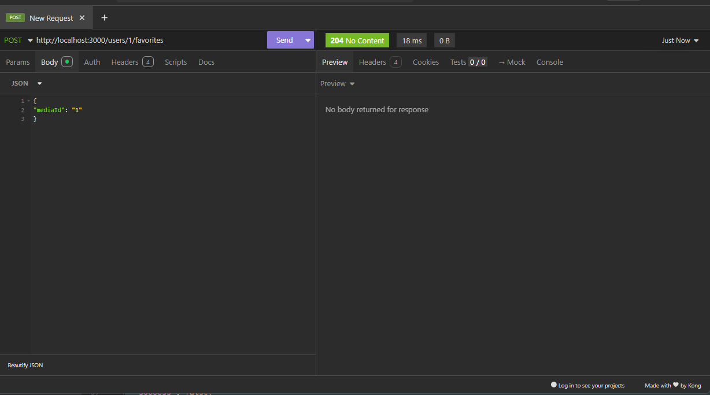

---

### ❌ Erro `404 Not Found` – `mediaId` inexistente

```json
{
  "success": false,
  "statusCode": 404,
  "error": "Not Found",
  "message": "Mídia com ID 100 não encontrada",
  "code": "MEDIA_NOT_FOUND",
  "timestamp": "2025-07-21T01:56:51.841Z",
  "path": "/users/1/favorites",
  "method": "POST"
}
```
---

* **Insomnia - print PNG:**


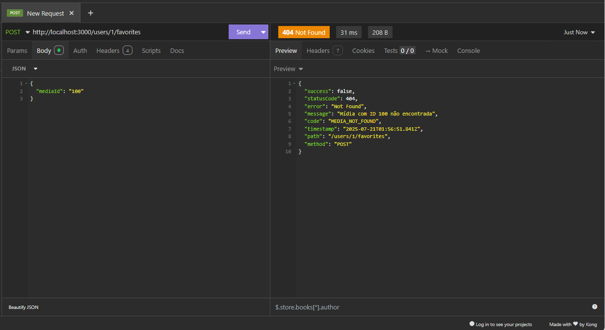


---

### ❌ Erro `409 Conflict` – Favorito já existe

```json
{
  "success": false,
  "statusCode": 409,
  "error": "Conflict",
  "message": "Favorito já existe",
  "code": "FAVORITE_ALREADY_EXISTS",
  "timestamp": "2025-07-21T01:59:09.343Z",
  "path": "/users/1/favorites",
  "method": "POST"
}
```
---

* **Insomnia - print PNG:**


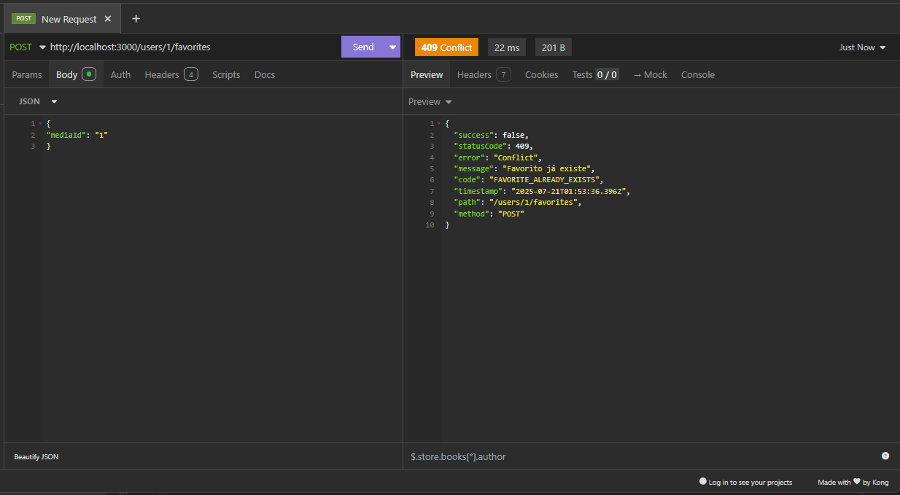


---

## ❌ POST `/users/999/favorites` – Usuário inexistente

```json
{
  "success": false,
  "statusCode": 404,
  "error": "Not Found",
  "message": "Usuário com ID 999 não encontrado",
  "code": "USER_NOT_FOUND",
  "timestamp": "2025-07-21T02:21:29.358Z",
  "path": "/users/999/favorites",
  "method": "POST"
}
```

---

* **Insomnia - print PNG:**

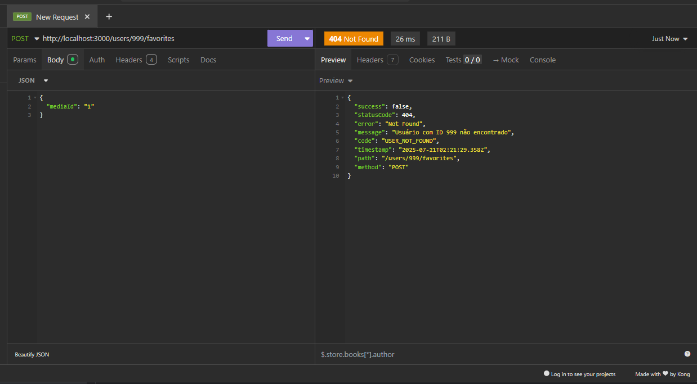


---

## 📄 GET `/users/{userId}/favorites`

### 📌 Descrição

Retorna todos os itens da lista de favoritos de um usuário.

### ✅ Resposta de Sucesso

```json
{
  "success": true,
  "statusCode": 200,
  "message": "Favoritos recuperados com sucesso para o usuário 1",
  "timestamp": "2025-07-21T02:01:10.858Z",
  "path": "/users/1/favorites",
  "method": "GET",
  "data": {
    "medias": [
      {
        "id": 1,
        "title": "O Código do Futuro",
        "description": "Um programador descobre uma conspiração digital.",
        "type": "movie",
        "releaseYear": 2023,
        "genre": "Ficção Científica",
        "genreId": 1,
        "langCode": "pt",
        "imageUrl": "https://example.com/images/codigo_futuro.jpg",
        "trailerUrl": "https://example.com/trailers/codigo_futuro.mp4",
        "releaseDate": "2023-06-15",
        "createdAt": "2025-07-20T20:41:21.916Z",
        "updatedAt": "2025-07-20T20:41:21.916Z"
      }
    ]
  }
}
```

---

* **Insomnia - print PNG:**

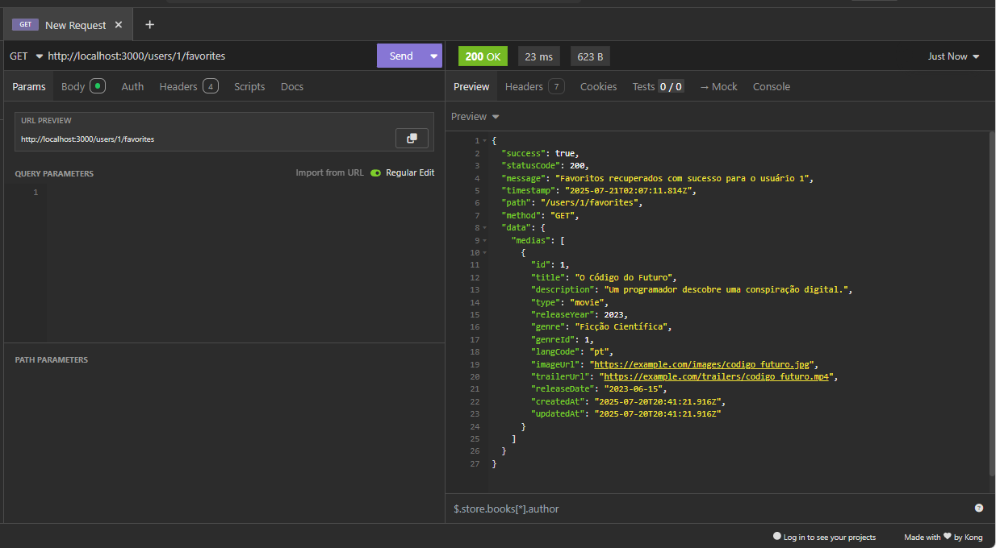

---

## ❌ GET `/users/{userId}/favorites` – Nenhum favorito

```json
{
  "success": true,
  "statusCode": 200,
  "message": "Favoritos recuperados com sucesso para o usuário 1",
  "timestamp": "2025-07-21T02:03:59.739Z",
  "path": "/users/1/favorites",
  "method": "GET",
  "data": {
    "medias": []
  }
}
```

---

* **Insomnia - print PNG:**

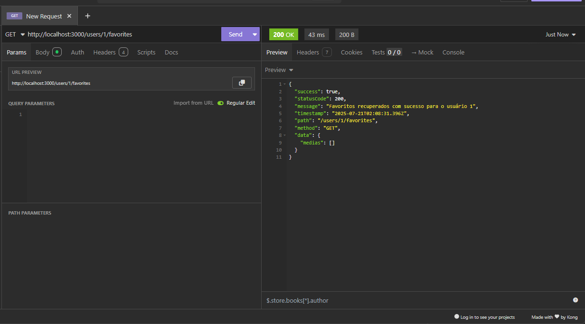


---

## ❌ GET `/users/999/favorites` – Usuário inexistente

```json
{
  "success": false,
  "statusCode": 404,
  "error": "Not Found",
  "message": "Usuário com ID 999 não encontrado",
  "code": "USER_NOT_FOUND",
  "timestamp": "2025-07-21T02:09:02.066Z",
  "path": "/users/999/favorites",
  "method": "GET"
}
```

---

* **Insomnia - print PNG:**

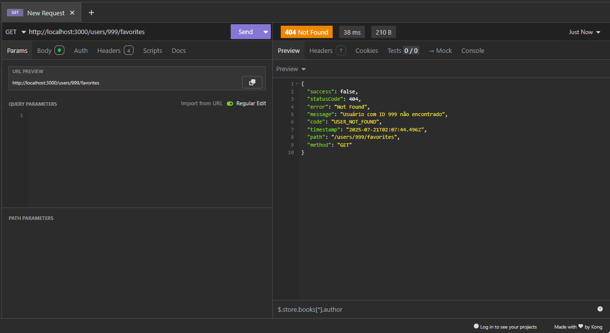


---

## 🗑 DELETE `/users/{userId}/favorites/{mediaId}`

### 📌 Descrição

Remove um item de mídia da lista de favoritos de um usuário.

### ✅ Resposta de Sucesso

* **Código:** `204 No Content`
* **Corpo:** Nenhum. Apenas o status HTTP.

---

* **Insomnia - print PNG:**

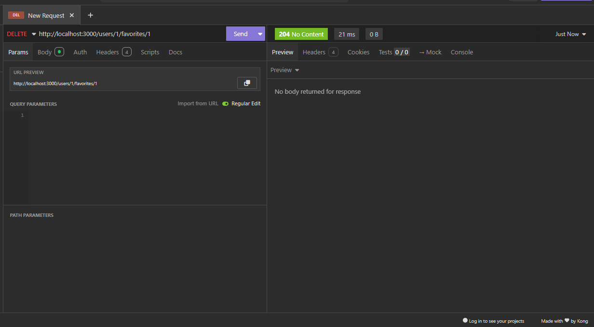


---


### ❌ Erro `404 Not Found` – `mediaId` não está nos favoritos

```json
{
  "success": false,
  "statusCode": 404,
  "error": "Not Found",
  "message": "Favorito não encontrado",
  "code": "FAVORITE_NOT_FOUND",
  "timestamp": "2025-07-21T02:11:55.184Z",
  "path": "/users/1/favorites/60",
  "method": "DELETE"
}
```

---

* **Insomnia - print PNG:**


---

# 🧪 Testes Automatizados com Jest - Módulo de Favoritos

Este módulo implementa testes automatizados para os serviços e controladores de favoritos utilizando o framework [Jest](https://jestjs.io/). Os testes seguem a abordagem **TDD** (Test Driven Development), garantindo confiabilidade e robustez para as funcionalidades relacionadas à gestão de favoritos na aplicação.

---

## ✅ O que os testes cobrem?

### 🔧 FavoriteService

Arquivo: `favorite.service.spec.ts`

Testa a lógica de negócio da camada de serviço responsável pelos favoritos.

- ✔️ **Criação de favoritos**
  - Quando os dados estão corretos (usuário e mídia existem), cria um favorito com sucesso.
  - Quando o usuário não existe, lança `UserNotFoundError`.
  - Quando a mídia não existe, lança `MediaNotFoundError`.
  - Quando o favorito já existe, lança `FavoriteAlreadyExistsError`.

- ✔️ **Busca de todos os favoritos de um usuário**
  - Retorna todas as mídias favoritas associadas a um usuário com sucesso.
  - Quando o usuário não existe, lança `UserNotFoundError`.

- ✔️ **Remoção de favoritos**
  - Remove um favorito com sucesso quando ele existe.
  - Quando o usuário não existe, lança `UserNotFoundError`.
  - Quando o favorito não existe, lança `FavoriteNotFoundError`.

---

### 🕹️ FavoriteController

Arquivo: `favorite.controller.spec.ts`

Testa a camada de controle responsável por intermediar as requisições HTTP e as chamadas de serviço.

- ✔️ **Criação de favoritos**
  - Cria um favorito e retorna `204 No Content`.
  - Se a mídia não existir, retorna `404 Not Found` com `MediaNotFoundError`.
  - Se o favorito já existir, retorna `409 Conflict` com `FavoriteAlreadyExistsError`.
  - Se o usuário não existir, retorna `404 Not Found` com `UserNotFoundError`.

- ✔️ **Listagem de favoritos**
  - Retorna todas as mídias favoritas de um usuário com `200 OK`.
  - Se o usuário não existir, retorna `404 Not Found` com `UserNotFoundError`.

- ✔️ **Remoção de favoritos**
  - Remove um favorito e retorna `204 No Content`.
  - Se o favorito não existir, retorna `404 Not Found` com `FavoriteNotFoundError`.
  - Se o usuário não existir, retorna `404 Not Found` com `UserNotFoundError`.

---

## 🧪 Ferramentas e Tecnologias

- **Jest**: Framework principal de testes.
- **@nestjs/testing**: Utilitário para facilitar testes em aplicações NestJS.
- **Mocks**: Implementação via `jest.fn()` para isolar dependências como repositórios e serviços auxiliares.
- **DTOs e Entidades**: Utilizados para simular dados reais durante os testes.
- **ResponseMapperFavoriteService**: Garante respostas padronizadas para sucessos e erros.

---

## 📝 Observações

- Os testes são **unitários**, não realizando chamadas reais a banco de dados ou APIs externas.
- A cobertura está focada nos **casos principais e críticos**, com tratamento de exceções personalizado.
- A estrutura de respostas segue o padrão centralizado com `ResponseMapperFavoriteService` para consistência em mensagens de erro.

---

## 🚀 Execução dos Testes

Para rodar os testes localmente:

```bash
npm test
# ou
pnpm test
```

Para visualização com cobertura:

```bash
npm test -- --coverage
```

---

## 🔒 Cobertura de Segurança

- Validação de existência de usuário e mídia antes da criação ou remoção de favoritos.
- Tratamento de exceções específicas para evitar exposições de detalhes internos.
- Simulação de falhas controladas para garantir respostas apropriadas ao cliente.

---

## 📊 Exemplo de Cobertura

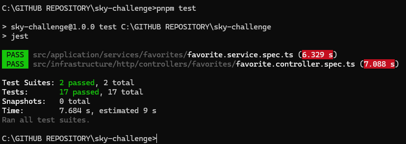

---

# 📄 Controle de Logs no `FavoriteService`

O serviço `FavoriteService` utiliza o `AppLoggerService`, uma camada personalizada baseada no `Logger` do NestJS, para registrar **ações**, **advertências** e **erros** durante o ciclo de vida da aplicação, focado na gestão de favoritos.

---

## 🔧 Ativando os logs

Para que os logs funcionem corretamente, é necessário ativar a variável de ambiente no `.env`:

```env
BACKEND_LOGS=true
```

## 📌 Logs Utilizados

* **`log()`**: ações normais

  ```ts
  this.logger.log(`Favorito criado com sucesso para usuário ${userId} e mídia ${createFavoriteDto.mediaId}`, this.context);
  ```

* **`error()`**: erros

  ```ts
  this.logger.error(`Erro ao criar favorito`, error, this.context);
  ```

---

## ⚙️ Sobre o `AppLoggerService`

* Se o `context` for passado, o log exibe `[FavoriteService] Mensagem`.
* Se não for passado, exibe apenas a mensagem.
* O `context` é definido como `'FavoriteService'` para identificar a origem dos logs.

---

## ✅ Benefícios

* Centraliza e organiza os logs relacionados aos favoritos.
* Facilita o rastreamento e debug de operações como criação, busca e remoção de favoritos.
* Integra exceções customizadas (`UserNotFoundError`, `MediaNotFoundError`, `FavoriteAlreadyExistsError`, `FavoriteNotFoundError`, `FavoriteUnexpectedError`) para mensagens claras e específicas.

---

## ✅ LOGS FAVORITE SUCCESS IMAGE PRINT PNG

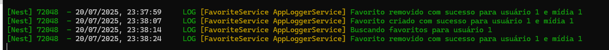

---

## ❌ LOGS FAVORITE ERROR IMAGE PRINT PNG

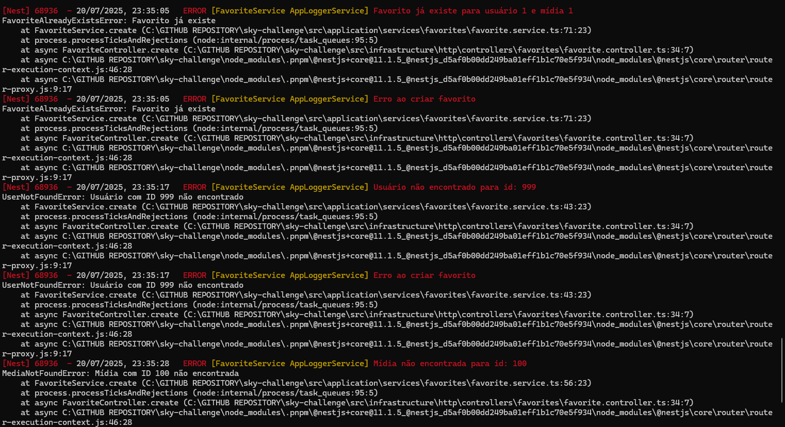

---