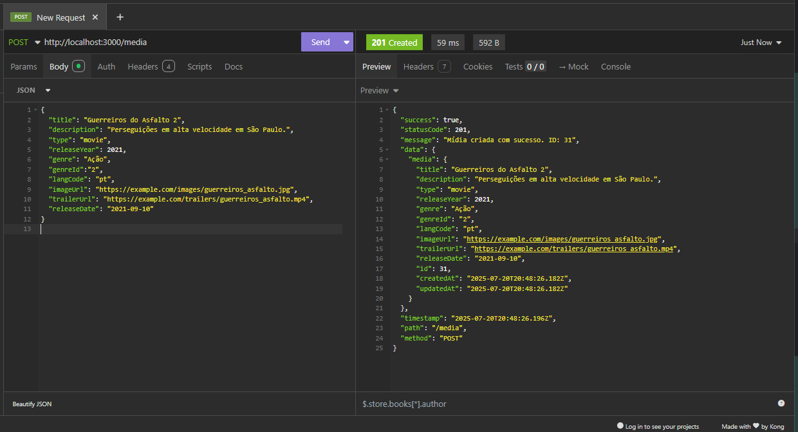
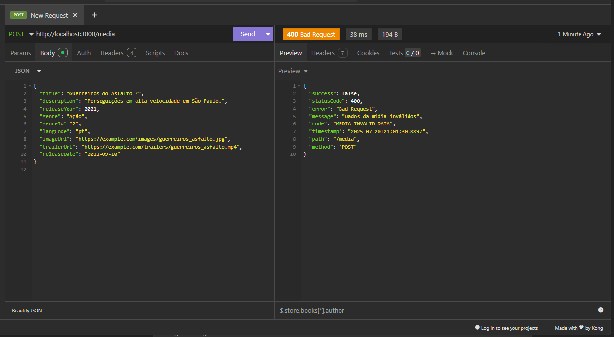
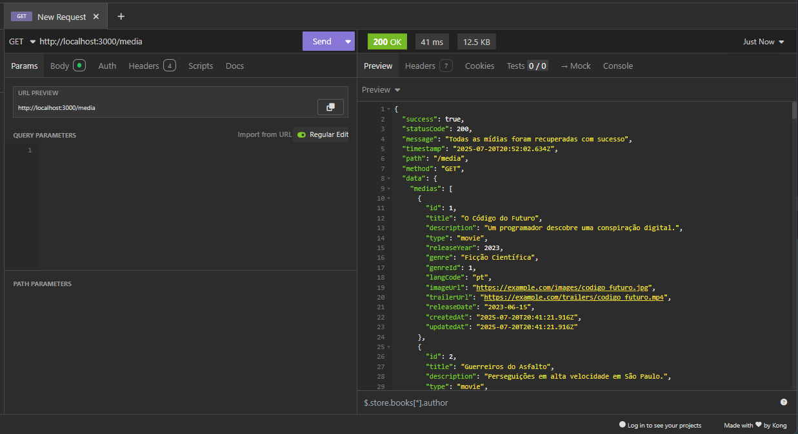
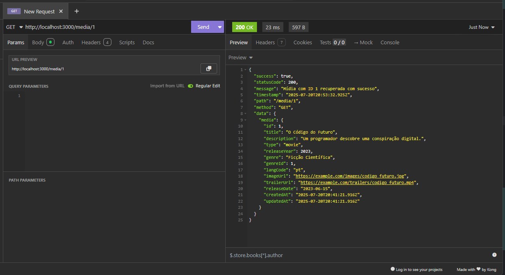
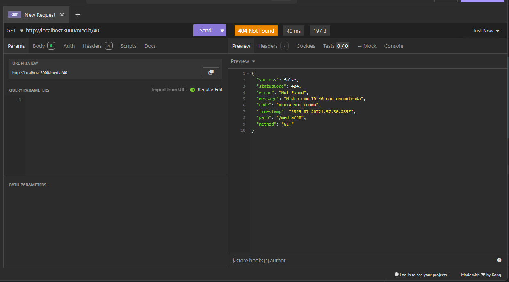
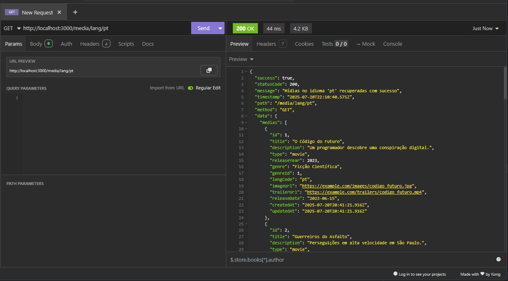
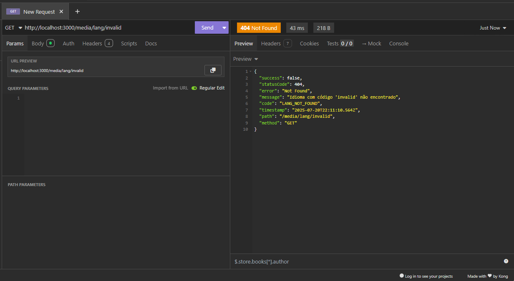
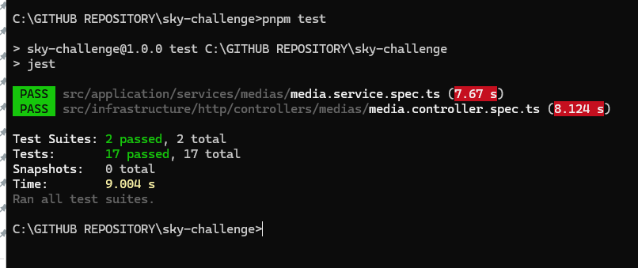

# 📦 API - Catálogo de Mídia (`/media`)

---

## ➕ POST `/media`

### 📌 Descrição

Adiciona uma nova mídia ao catálogo.

### 📝 Requisição

* **Método:** `POST`
* **URL:** `/media`
* **Headers:**

  * `Content-Type: application/json`
* **Corpo (JSON):**

```json
{
  "title": "Guerreiros do Asfalto 2",
  "description": "Perseguições em alta velocidade em São Paulo.",
  "type": "movie",
  "releaseYear": 2021,
  "genre": "Ação",
  "genreId": "2",
  "langCode": "pt",
  "imageUrl": "https://example.com/images/guerreiros_asfalto.jpg",
  "trailerUrl": "https://example.com/trailers/guerreiros_asfalto.mp4",
  "releaseDate": "2021-09-10"
}
```


### ✅ Resposta de Sucesso

* **Código:** `201 Created`
* **Corpo:**

```json
{
  "success": true,
  "statusCode": 201,
  "message": "Mídia criada com sucesso. ID: 31",
  "data": {
    "media": {
      "id": 31,
      "title": "Guerreiros do Asfalto 2",
      "description": "Perseguições em alta velocidade em São Paulo.",
      "type": "movie",
      "releaseYear": 2021,
      "genre": "Ação",
      "genreId": "2",
      "langCode": "pt",
      "imageUrl": "https://example.com/images/guerreiros_asfalto.jpg",
      "trailerUrl": "https://example.com/trailers/guerreiros_asfalto.mp4",
      "releaseDate": "2021-09-10",
      "createdAt": "2025-07-20T20:48:26.182Z",
      "updatedAt": "2025-07-20T20:48:26.182Z"
    }
  },
  "timestamp": "2025-07-20T20:48:26.196Z",
  "path": "/media",
  "method": "POST"
}
```

---

* **Insomnia - print PNG:**




---


### ❌ Erro `400 Bad Request` – Dados inválidos

#### 📤 Requisição com erro (campo `type` ausente):

```json
{
  "title": "Guerreiros do Asfalto 2",
  "description": "Perseguições em alta velocidade em São Paulo.",
  "releaseYear": 2021,
  "genre": "Ação",
  "genreId": "2",
  "langCode": "pt",
  "imageUrl": "https://example.com/images/guerreiros_asfalto.jpg",
  "trailerUrl": "https://example.com/trailers/guerreiros_asfalto.mp4",
  "releaseDate": "2021-09-10"
}
```

#### ❗ Resposta:

```json
{
  "success": false,
  "statusCode": 400,
  "error": "Bad Request",
  "message": "Dados da mídia inválidos",
  "code": "MEDIA_INVALID_DATA",
  "timestamp": "2025-07-20T21:01:30.889Z",
  "path": "/media",
  "method": "POST"
}
```

---

* **Insomnia - print PNG:**




---


## 📄 GET `/media`

### 📌 Descrição

Retorna todos os itens do catálogo.

### ✅ Resposta de Sucesso

```json
{
  "success": true,
  "statusCode": 200,
  "message": "Todas as mídias foram recuperadas com sucesso",
  "timestamp": "2025-07-20T20:51:20.973Z",
  "path": "/media",
  "method": "GET",
  "data": {
    "medias": [
      {
        "id": 1,
        "title": "O Código do Futuro",
        "description": "Um programador descobre uma conspiração digital.",
        "type": "movie",
        "releaseYear": 2023,
        "genre": "Ficção Científica",
        "genreId": 1,
        "langCode": "pt",
        "imageUrl": "https://example.com/images/codigo_futuro.jpg",
        "trailerUrl": "https://example.com/trailers/codigo_futuro.mp4",
        "releaseDate": "2023-06-15",
        "createdAt": "2025-07-20T20:41:21.916Z",
        "updatedAt": "2025-07-20T20:41:21.916Z"
      },
      ...
    ]
  }
}
```
---

* **Insomnia - print PNG:**




---

---

## 🔍 GET `/media/{id}`

### 📌 Descrição

Busca uma mídia específica pelo seu `id`.

### ✅ Resposta de Sucesso (Exemplo com ID 1)

```json
{
  "success": true,
  "statusCode": 200,
  "message": "Mídia com ID 1 recuperada com sucesso",
  "timestamp": "2025-07-20T20:56:42.357Z",
  "path": "/media/1",
  "method": "GET",
  "data": {
    "media": {
      "id": 1,
      "title": "O Código do Futuro",
      "description": "Um programador descobre uma conspiração digital.",
      "type": "movie",
      "releaseYear": 2023,
      "genre": "Ficção Científica",
      "genreId": 1,
      "langCode": "pt",
      "imageUrl": "https://example.com/images/codigo_futuro.jpg",
      "trailerUrl": "https://example.com/trailers/codigo_futuro.mp4",
      "releaseDate": "2023-06-15",
      "createdAt": "2025-07-20T20:41:21.916Z",
      "updatedAt": "2025-07-20T20:41:21.916Z"
    }
  }
}
```

---

* **Insomnia - print PNG:**




---

### ❌ Erro `404 Not Found` – ID inexistente

```json
{
  "success": false,
  "statusCode": 404,
  "error": "Not Found",
  "message": "Mídia com ID 40 não encontrada",
  "code": "MEDIA_NOT_FOUND",
  "timestamp": "2025-07-20T21:57:30.885Z",
  "path": "/media/40",
  "method": "GET"
}
```

---

* **Insomnia - print PNG:**




---

---

## 🌐 GET `/media/lang/{langcode}` - Extra - Endpoint

### 📌 Descrição

Busca mídias por código de idioma (ex: `pt`, `en`, `es`).

### ✅ Resposta de Sucesso (Exemplo com `pt`)

```json
{
  "success": true,
  "statusCode": 200,
  "message": "Mídias no idioma 'pt' recuperadas com sucesso",
  "timestamp": "2025-07-20T23:19:22.197Z",
  "path": "/media/lang/pt",
  "method": "GET",
  "data": {
    "medias": [
      {
        "id": 1,
        "title": "O Código do Futuro",
        "description": "Um programador descobre uma conspiração digital.",
        "type": "movie",
        "releaseYear": 2023,
        "genre": "Ficção Científica",
        "genreId": 1,
        "langCode": "pt",
        "imageUrl": "https://example.com/images/codigo_futuro.jpg",
        "trailerUrl": "https://example.com/trailers/codigo_futuro.mp4",
        "releaseDate": "2023-06-15",
        "createdAt": "2025-07-20T20:41:21.916Z",
        "updatedAt": "2025-07-20T20:41:21.916Z"
      },
      ...
    ]
  }
}
```

---

* **Insomnia - print PNG:**




---

### ❌ Erro `404 Not Found` – Idioma inválido

```json
{
  "success": false,
  "statusCode": 404,
  "error": "Not Found",
  "message": "Idioma com código 'invalid' não encontrado",
  "code": "LANG_NOT_FOUND",
  "timestamp": "2025-07-20T22:14:56.898Z",
  "path": "/media/lang/invalid",
  "method": "GET"
}
```

---

* **Insomnia - print PNG:**




---

---

# 🧪 Testes Automatizados com Jest - Módulo de Mídias

Este módulo implementa testes automatizados para os serviços e controladores de mídias utilizando o framework [Jest](https://jestjs.io/). Os testes seguem a abordagem **TDD** (Test Driven Development), garantindo confiabilidade e robustez para as funcionalidades da aplicação.

---

## ✅ O que os testes cobrem?

### 🔧 MediaService

Arquivo: `media.service.spec.ts`

Testa a lógica de negócio da camada de serviço responsável pelas mídias.

- ✔️ **Criação de mídias**
  - Quando os dados estão corretos, cria uma nova mídia com sucesso.
  - Quando o título está vazio ou inválido, lança `MediaInvalidDataError`.
  - (Comentado) Quando a mídia já existe, lançaria `MediaAlreadyExistsError`.

- ✔️ **Busca de todas as mídias**
  - Retorna todas as mídias com sucesso.
  - Em caso de erro inesperado (ex: erro no banco), lança `MediaUnexpectedError`.

- ✔️ **Busca de mídia por ID**
  - Retorna uma mídia específica pelo ID.
  - Se não encontrada, lança `MediaNotFoundError`.

- ✔️ **Busca de mídias por idioma (`langCode`)**
  - Retorna todas as mídias associadas ao idioma informado.
  - Se o idioma não for encontrado, lança `LangNotFoundError`.
  - Erros inesperados também são tratados com `MediaUnexpectedError`.

---

### 🕹️ MediaController

Arquivo: `media.controller.spec.ts`

Testa a camada de controle responsável por intermediar as requisições HTTP e as chamadas de serviço.

- ✔️ **Criação de mídias**
  - Cria uma mídia e retorna `201 Created`.
  - Se a mídia já existir, retorna `409 Conflict` com `MediaAlreadyExistsError`.

- ✔️ **Listagem geral de mídias**
  - Retorna todas as mídias com `200 OK`.

- ✔️ **Consulta por ID**
  - Retorna uma mídia específica pelo ID com `200 OK`.
  - Se não encontrada, retorna `404 Not Found` com `MediaNotFoundError`.

- ✔️ **Consulta por idioma**
  - Retorna mídias filtradas por idioma.
  - Se o idioma não for encontrado, retorna `404 Not Found` com `LangNotFoundError`.

---

## 🧪 Ferramentas e Tecnologias

- **Jest**: Framework principal de testes.
- **@nestjs/testing**: Utilitário para facilitar testes em aplicações NestJS.
- **Mocks**: Implementação via `jest.fn()` para isolar dependências como repositórios e serviços auxiliares.
- **DTOs e Entidades**: Utilizados para simular dados reais durante os testes.

---

## 📝 Observações

- Os testes são **unitários**, não realizando chamadas reais a banco de dados ou APIs externas.
- A cobertura está focada nos **casos principais e críticos**, com tratamento de exceções personalizado.
- A estrutura de respostas segue o padrão centralizado com `ResponseMapper` para consistência em mensagens de erro.

---

## 🚀 Execução dos Testes

Para rodar os testes localmente:

```bash
npm test
# ou
pnpm test
````

Para visualização com cobertura:

```bash
npm  test
```

---

## 🔒 Cobertura de Segurança

* Validação de dados obrigatórios antes da persistência.
* Tratamento de exceções específicas para evitar exposições de detalhes internos.
* Simulação de falhas controladas para garantir resposta apropriada ao cliente.

---



---


